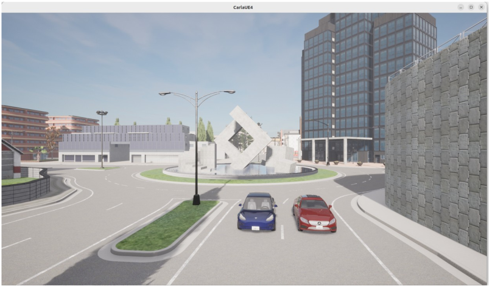
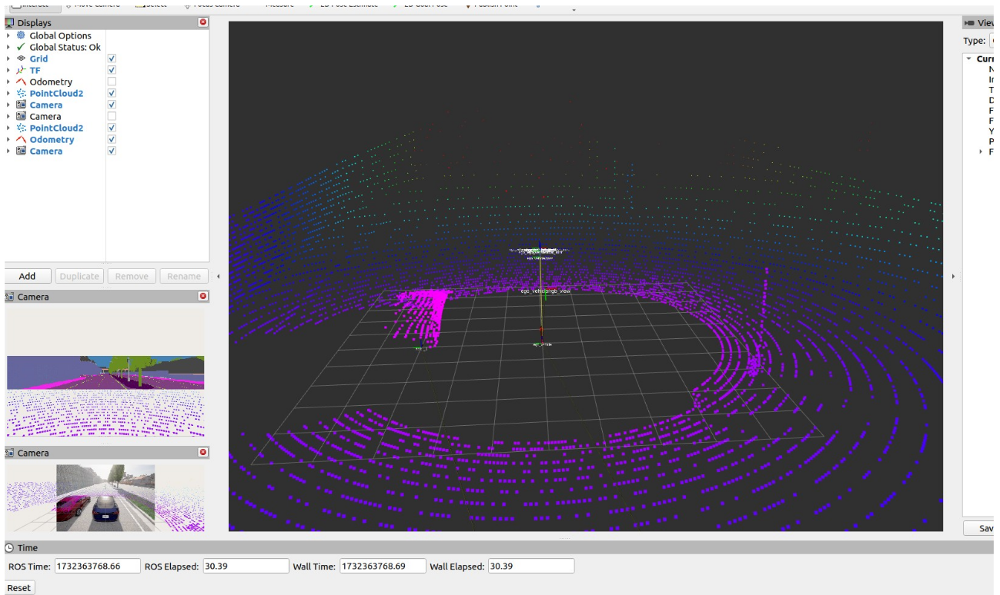

**Carla simulation to generate Odometry & sensor data**

Project Demo: [Screen recording](https://www.loom.com/share/d0ed514a05ed43adb650a5a9df079e39?sid=9b3731d3-f618-4eb5-8acc-7cc14b6268c1)

**Summary:**
This package contains a ROS2 package (ament cmake type), which holds a single "executor_node". This executor node is responsible for simulating a driving scenario in Carla simulator through interaction over carla-ROS bridge. This package was built & tested with ROS2 humble. This node will simulate an ego-vehicle and an actor vehicle, and then save the sensor data from the ego vehicle.

I have selected a scenario of "ego-vehicle being overtaken, and cut-in by a passing actor vehicle". Ego-car (Blue) will be moving with a speed of 3m/s, while actor_1 will be moving with 4m/s. At time = 3.0 secs, the actor_1 car will cut & merge into the ego-car's lane with a lateral speed of 0.6m/s. After merging, the leading vehicle will also slow down to 3m/s, followed by the ego-vehicle running at a similar speed. Note: For the sake of simplicity, the driving models are not selected to be Ackerman, hence, lateral motion is possible. Although, merging speed has been set very low to mimic the behavior of a proper Ackerman car.

**Control:**
Both ego-car and actor_1 are being controlled directly by setting their transforms directly using ROS2 executor node, over a rate of 10 frames per sec. These transforms are being controlled directly from topics:
- carla/ego_vehicle/control/set_transform
- carla/actor_1/control/set_transform (geometry_msgs::msg::Pose)

Executor node calculates the positions of both cars over time at the rate of 10 updates per second, and then publishes the updated positions of the cars in the corresponding set_transform topics, hence simulating the motion of these cars over a desired set-speed. (Assuming a constant-velocity model)

Along with control, the node also subscribes to topics to receive:
- GPS (carla/ego_vehicle/gnss)
- Lidar (carla/ego_vehicle/lidar)
- IMU (carla/ego_vehicle/imu)
- Camera (carla/ego_vehicle/rgb_front/image)

The received data is saved in an MCAP file at location: "/home/saad/pro_ws/src/merge_simulation/data/latest_data_dump" (It can be changed by passing an argument as "dump_path" in the ros2 run command.)

**Steps to run:**
Assuming that the user has installed the Carla simulator, ROS-bridge, and ROS2 humble already on the computer, the steps would be:
1) Add the package in the ros workspace:
    - Add the package "merge_simulation" in the active ros workspace /src directory.
    - Build the workspace using "colcon build".

2) Run Carla & initialize ros-bridge connection:
    - Run Carla simulator in a terminal.
    - Start ros-carla bridge in a new terminal window using the command:
      ```
      ros2 launch carla_ros_bridge carla_ros_bridge.launch.py host:=localhost port:=2000 timeout:=5000 town:=Town03 synchronous_mode:=True
      ```
    - This will start a ros_bridge instance at port 2000 with a timeout of 5 secs.
    - Please wait until the connection is successfully completed.

3) Spawn ego-vehicle and actor_1:
    - In a new terminal, launch:
      ```
      ros2 launch carla_spawn_objects carla_example_ego_vehicle.launch.py spawn_sensors_only:=False objects_definition_file:=/home/saad/pro_ws/src/merge_simulation/config/objects.json
      ```
    

    Spawned cars (ego-car: Blue, actor-car: Red)
    
    - Note: Please change the path according to your workspace. The desired objects.json file is present in the config directory of the merge_simulation package.
    - This object.json file will spawn Ego_vehicle and an actor_1 vehicle at predefined positions.

4) Launch Rviz for visualization:
    - Launch rviz using the command "rviz2".
    - Open config "rviz_config.rviz" in "rviz" directory of our package.

    

    This image shows the RVIZ screen with the ego vehicle set as the reference frame. The actor vehicle can be seen in the point cloud on the left side.

5) Launch executor node:
    - Finally, launch the executor node:
      ```
      ros2 run merge_simulation executor --ros-args -p dump_path:=sensor_data_dump
      ```
    - The node will start and show messages like:
      ```
      [INFO] [1732363957.820805315] [ego_vehicle_control_node]: Ego vehicle control node has started
      [INFO] [1732363957.835663167] [ego_vehicle_control_node]: Received GNSS data: latitude=0.000045, longitude=0.000278, altitude=2.001481
      [INFO] [1732363957.840251675] [ego_vehicle_control_node]: Received IMU data: orientation=(-0.000024, -0.000026, -0.000000, 1.000000), angular_velocity=(-0.000000, 0.000000, -0.000000), linear_acceleration=(0.000513, -0.000470, 9.810000)
      [INFO] [1732363957.967321885] [ego_vehicle_control_node]: Received image data: width=800, height=600, encoding=bgra8
      [INFO] [1732363958.006772068] [ego_vehicle_control_node]: Received LIDAR data: width=8226, height=1, point step=16
      [INFO] [1732363958.058246589] [ego_vehicle_control_node]: Received GNSS data: latitude=0.000045, longitude=0.000278, altitude=2.001481
      ```
    - This node will run for 20 secs by default. The user can stop the node at any time by sending CTRL+C in the terminal as well.
    - The user should see the red car swerving in the lane of the ego-vehicle and then the ego-vehicle will keep following the lead vehicle. The RVIZ screen should also show the motion in the camera view and lidar point cloud as well.

After the execution, please go to the dump path directory: "/home/saad/lidar_bag/sensor_data_dump/" (in my case). The details can be checked in the metadata.yaml file.
